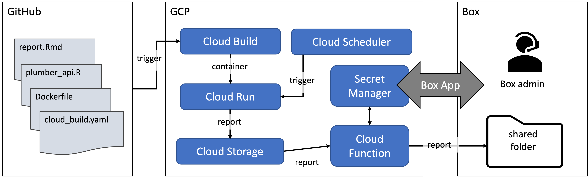

# demo-gcp-pipeline

This is an end-to-end demo of an Analytics/Reporting Pipeline implemented in GCP. 

A [YouTube video](https://studio.youtube.com/video/I3LtvlNhtwc/edit) of the demo is available on the Conect Analytics Team private YouTube channel.

The following GCP Services are used to implement this pipeline.

1.  Cloud Build

2.  Cloud Run

3.  Cloud Scheduler

4.  Google Cloud Storage

5.  Cloud Functions

## Workflow Diagram

